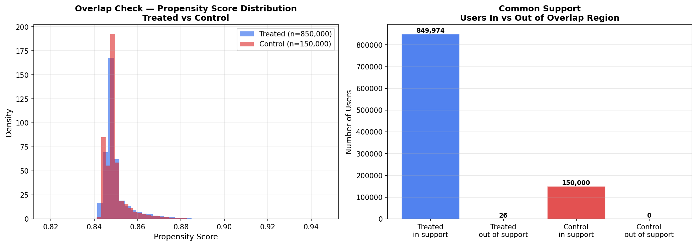
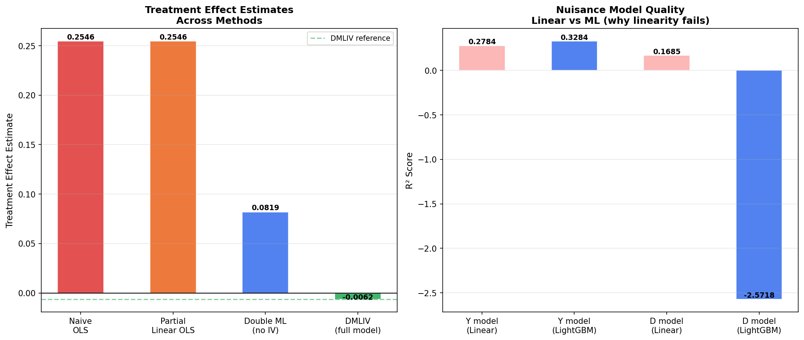
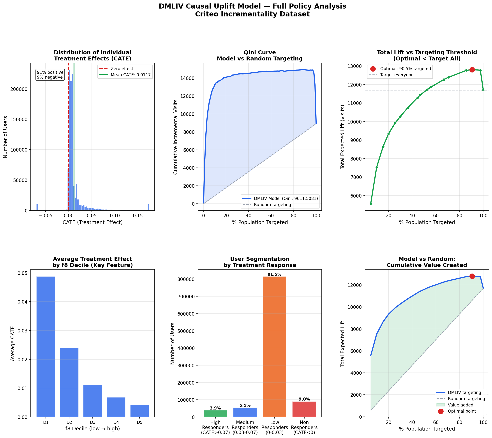

# Causal Uplift Modeling with Double ML IV
**Estimating heterogeneous ad effects using causal inference on the Criteo 
incrementality dataset**

---

## Business Question
Does ad exposure causally increase user visits — and which users respond most?

Naive comparison of exposed vs unexposed users is biased. This project applies
Double ML with an Instrumental Variable (DMLIV) to isolate the true causal 
effect of ad exposure, then estimates Conditional Average Treatment Effects 
(CATE) to identify which user segments respond most.

---

## Key Results

| Metric | Value |
|---|---|
| OLS bias vs DMLIV | 210.8% overstatement |
| Confounding share of bias | 66% |
| Endogeneity share of bias | 34% |
| ATE | -0.006 (95% CI: -0.018, 0.009) |
| Users with positive CATE | 91% |
| Users with negative CATE | 9% |
| Optimal targeting threshold | 90.5% of users |
| Lift gain vs target-all | +9.4% |
| Qini coefficient | 9,611 |

---

## Why DMLIV — Not Standard Regression

Three compounding problems make naive estimation invalid:

**1. Nonlinear confounding**
Features f0–f11 strongly predict both who gets exposed and whether they visit
(nuisance model AUC: 0.92–0.94). OLS assumes linearity — LightGBM in the 
Double ML first stage removes this assumption.

**2. Endogeneity**
Actual ad exposure (D) is not random — users self-select into seeing ads. 
Even after controlling for observables, unobservable selection bias remains.

**3. Instrument solution**
Treatment assignment (Z) was randomly assigned by Criteo (F-stat: 5,575, 
instrument AUC: 0.507). We use Z as an instrument for D — isolating only the 
clean, randomized variation in exposure.

---

## Methodology

---

## Assumption Validation

| Assumption | Test | Result |
|---|---|---|
| Overlap / Positivity | Propensity score distributions | 100% common support ✅ |
| Instrument relevance | First-stage F-statistic | F = 5,575 ✅ |
| Instrument exogeneity | Z nuisance model AUC | AUC = 0.507 ✅ |
| Confounding severity | Y, D nuisance AUC | 0.94 / 0.92 ✅ |
| OLS linearity failure | R² linear vs LightGBM | LightGBM dominates ✅ |

---

## Visualizations

### Overlap Check — Positivity Assumption


### OLS vs Double ML — Bias Decomposition


### Full Policy Dashboard


---

## Core Finding

> *The average treatment effect was statistically insignificant — masking 
> substantial heterogeneity. 91% of users show positive response to ad exposure 
> while 9% are actively harmed. Targeting the right users generates 9.4% more 
> incremental visits than targeting everyone.*

---

## Stack
Python · EconML · LightGBM · scikit-learn · pandas · matplotlib · NumPy

---

## Data
Criteo Uplift Modeling Dataset — 
https://ailab.criteo.com/criteo-uplift-prediction-dataset/

The dataset is not included in this repository (459MB). Download it from the 
link above and place it in the `data/` folder.

---

## Reproducing Results

```bash
# Clone the repo
git clone https://github.com/YOUR_USERNAME/causal-uplift-dmliv
cd causal-uplift-dmliv

# Install dependencies
pip install -r requirements.txt

# Download data from Criteo and place in data/
# Then run the notebook
jupyter notebook notebooks/causal_uplift_dmliv.ipynb
```

---

## Limitations
- Features are anonymized — effect modifiers cannot be given business 
  interpretation without domain knowledge
- LATE applies only to compliers (3.6% of treated users)
- Criteo scrambled the true incrementality level — absolute effect sizes 
  are not Criteo's real business metrics
